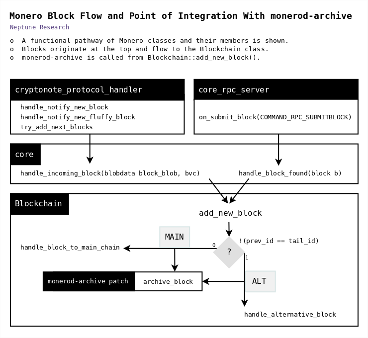

# monerod-archive
monerod-archive is a patch for [monerod](https://github.com/monero-project/monero) which enables [constant filesystem recording](#filesystem-recording) of:  
  
- [x] :package: **Blocks**: incoming blocks (both mainchain and altchain)  
- [x] :alarm_clock: **Timing**: Node Received Timestamp (NRT) of incoming blocks  
- [x] :bar_chart: **Alternate Blockchains**: the daemon's state of alternate blockchains
- [x] :signal_strength: **Synchronization State**: the daemon's state of mainchain synchronization
  
monerod-archive operates like a normal monerod as this data is recorded.  
  
  
  
> monerod-archive is copyright (c) 2018 Neptune Research.  
monerod-archive is offered under the BSD-3-Clause open source license. See [LICENSE](LICENSE) for more information.  

> monerod-archive is an extension to [Monero](https://github.com/monero-project/monero).  
Monero is copyright (c) 2014-2018 The Monero Project, portions (c) 2012-2013 The Cryptonote developers.  
Learn more about Monero on [getmonero.org](https://getmonero.org/).

> monerod-archive was developed for the [Monero Archival Project](https://github.com/mitchellpkt/monero_archival_project).  


---
## Table of Contents
- [Installation](#installation)
- [Operation](#operation)
- [Output](#output)  
  - [Daemon Console](#daemon-console)
  - [Filesystem Recording](#filesystem-recording)
  - [Output Fields](#output-fields)
- [Building](#building)
  - [Monerod Compatibility](#monerod-compatibility)
  - [1. Get Monero](#1-get-monero)
  - [2. Get monerod-archive](#2-get-monerod-archive)
  - [3. Patch Monero](#3-patch-monero)
  - [4. Build Monero with monerod-archive](#4-build-monero-with-monerod-archive)
- [Components](#components)
  - [Point of Integration: Block Handler](#point-of-integration-block-handler)
  - [Synchronization State: Block Handler Callers](#synchronization-state-block-handler-callers)
  - [Archive Producer](#archive-producer)
  - [Monero Source Dependencies](#monero-source-dependencies)
- [Appendix](#appendix)
  - [Sqlite table: monerodarchive](#sqlite-table-monerodarchive)
  - [monerod-archive v6 Output](#monerod-archive-v6-output)
  - [monerod-archive-v5 Output](#monerod-archive-v5-output)
  - [Changelog](#changelog)


---
# Installation

monerod-archive requires
- Archive Output Directory `/opt/monerodarchive/`
- glibc 2.27

### 1. Archive Output Directory
monerod-archive requires the specific directory `/opt/monerodarchive` and it must be writable by monerod.

**Quick installation**  
Run the install script `setup/monerod-archive-install.sh`.  
  
**Manual steps**

    # create Archive Output Directory
    sudo mkdir /opt/monerodarchive
    
    # allow monerod to write via read,write access for everyone
    sudo chmod 666 /opt/monerodarchive


### 2. Glibc Update (Binary Release only)
monerod-archive binary release currently requires glibc 2.27. You may need to update your glibc to run it. glibc 2.27 is almost completely backwards compatible with older glibc, but you may also solve a glibc conflict via containerization or building the monerod-archive binary yourself.

Check your glibc version:

    ldd --version

##### Ubuntu/Debian Instructions
You can update with ``apt-get install libc6-dev`` from the Sid (unstable) Debian apt repo.  
Follow this update guide for Debian (thanks @serhack):

    To upgrade you need to follow these passages. 
    Warning: if you run commands and you don't know what they do, 
    please don't try to upgrade G_LIBC!
    
    1. Open with any editor the /etc/apt/sources.list
    2. Add the following line deb http://ftp.us.debian.org/debian sid main
    3. Run apt-get update
    4. Let's upgrade LIBC! Run apt-get install libc6-dev and then wait...
    5. Reopen /etc/apt/sources.list and comment (with "#") the line you wrote in the step 2. Enjoy!
    
    NEVER NEVER run a apt-get upgrade or apt-get full-upgrade while you are touching /etc/apt/sources.list . 
    If you upgrade all the packages to "sid", the system can become unstable.


---
# Operation
monerod-archive operates like a normal monerod.  

Follow ["Running monerod" in the Monero README](https://github.com/monero-project/monero#running-monerod).

As of monerod-archive v6, the archive automatically starts and cannot be disabled.

While monerod-archive runs:

- [x] you will see archive messages on the [daemon console](#daemon-console)
- [x] and [an archive file](#filesystem-recording) will be recorded


---
# Output

This is **Archive Output Version 7**.  
For output from previous archive versions, see [Appendix](#appendix).  
  
## Daemon Console

When a block is received by the Block Handler and the Archive Producer is about to run  
(*GLOBAL log category, INFO log level*):

    Block Archive MAIN H=0 MRT=0000000000 NRT=0000000000000 n_alt_chains=0 SYNC NCH=0 NTH=0

| Key | Description |  
| - | - |  
| [MAIN/ALT](#is-alt-block) | MAIN if block is bound for mainchain handler, 'ALT ' else (there is 1 space right padding) |  
| [H](#block-json) | Block height, read from block |  
| [MRT](#block-json) | Miner Reported Timestamp, Unix epoch seconds (10 digits), read from block |  
| [NRT](#nrt) | Node Reported Timestamp, Unix epoch milliseconds (13 digits), read from system clock |  
| [n_alt_chains](#alt-chains-length-n_alt_chains) | Number of alternate blockchains in daemon, read from daemon state |  
| [SYNC/FULL](#is-node-synced) | Daemon mainchain sync state: SYNC=syncing, FULL=synced |  
| [NCH](#nch) | Node Current Height, read from daemon state |  
| [NTH](#nth) | Node Target Height, read from daemon state |  


## Filesystem Recording

As of monerod-archive v6, archive entries are recorded in append mode to a single file.

One archive entry is made per incoming block.

Filesystem recording will fail silently if the Archive Output Directory is not available.


### Archive File
Filename: `/opt/monerodarchive/archive.log`

Archive output fields are tab-delimited "\t".

Line example:  

    7	532871954727	1	{"major_version": 1, "minor_version": 0, "timestamp": 1402673384, "prev_id": "dc13872f56acdc742a73508ff5ca9bb53250be7ed67fc3f25d8ad00c291099e7", "nonce": 1073742811, "miner_tx": {"version": 1, "unlock_time": 83696, "vin": [ {"gen": {"height": 83636}}], "vout": [ {"amount": 4001075093, "target": {"key": "04e0e92193a84b4ea5ffd49fa6b4696263e013aa28c42ef5d5f0a21329ec065d"}}, {"amount": 80000000000, "target": {"key": "19df558f9df5e2bd3c6921c9f5bb470c230a11467fedd74192e5bcaa37ea5cc3"}}, {"amount": 200000000000, "target": {"key": "1bc686513c1f86cd67ce48c25d3b83767da6949de354d3f84b6e6c6cbac71976"}}, {"amount": 6000000000000, "target": {"key": "3067b47349622701d410711ca8a87a473995c322df0b80c2b249bd6598c7b64d"}}, {"amount": 10000000000000, "target": {"key": "6a803d29300975504e7eee2fdb2a0e92995de925e207659dac0ccd90802b25a8"}}], "extra": [ 1, 225, 235, 208, 96, 218, 92, 35, 141, 25, 226, 55, 205, 31, 185, 117, 86, 153, 56, 17, 188, 73, 168, 16, 102, 95, 180, 84, 138, 233, 137, 141, 130, 2, 8, 0, 0, 0, 2, 126, 21, 54, 222], "signatures": [ ]}, "tx_hashes": [ "5af850ea6bdc70a16710ed1396e28991a2fdacb084d7e3fdb63262b793e990e6"]}	1	[{"length":1,"height":2,"deep":2,"diff":0,"hash":"ba8bc38ba847a63b71ab8b8af7eba7ba87be87afa7bef7828ab288cb28a742b4"}]	1	83636	83636


## Output Fields

### Ordering

| # | Output Field |
| - | - |
| 1 | [Archive Version](#archive-version)
| 2 | [NRT](#nrt) |
| 3 | [Is Alt Block?](#is-alt-block) |
| 4 | [Block JSON](#block-json) |
| 5 | [Alt Chains Length (n_alt_chains)](#alt-chains-length-n_alt_chains) |
| 6 | [Alt Chains Info JSON](#alt-chains-info-json) |
| 7 | [Is Node Synced?](#is-node-synced) |
| 8 | [NCH](#nch) |
| 9 | [NTH](#nth) |


---

### Archive Version
##### type: _**int**_
Version number of monerod-archive which created this archive entry.  
  
Minimum ```7```.  

    V=7

---

### NRT 
##### type: _**int**_
Unix epoch milliseconds (13 digits).  
  
Node Received Timestamp (NRT) is the value of the local system clock at the time of this archive entry.  

---

### Is Alt Block?
##### type: _**bool**_

    0 = Main Block
    1 = Alt  Block 

---

### Block JSON
##### type: _**JSON string, deep object**_

```Cryptonote::Block``` object serialized as JSON.

All complex member types like ```transaction``` and ```std::vector``` are also serialized.

Note: the field *timestamp* is also known as *Miner Reported Timestamp (MRT)*.


#### Cryptonote::Block (C++ definition)
See ```struct block_header``` and ```struct block``` in `cryptonote_basic/cryptonote_basic.h` (Monero 0.12.3.0).
  
Simplified struct:  
  
    uint8_t major_version
    uint8_t minor_version
    uint64_t timestamp;
    
    // This serializes as a string.
    crypto::hash  prev_id;
    
    uint32_t nonce;
    
    // This is a separate JSON structure for struct transaction, see cryptonote_basic.h.
	transaction miner_tx;
    
    // This serializes as array of strings.
    std::vector<crypto::hash> tx_hashes;

    // hash cash
    // NOTE: this hash is not serialized by Monero 0.12.3.0
    mutable crypto::hash hash;


#### Cryptonote::Block (JSON example)

    {
      "major_version": 7, 
      "minor_version": 7, 
      "timestamp": 1529212586, 
      "prev_id": "e74352652392b9a3014e64598b1b3910eafd65ce95db6d648960f5eac534c83b", 
      "nonce": 738199637, 
      "miner_tx": {
        "version": 2, 
        "unlock_time": 1596770, 
        "vin": [ {
            "gen": {
              "height": 1596710
            }
          }
        ], 
        "vout": [ {
            "amount": 4402424939349, 
            "target": {
              "key": "a645b3167de95bdf17295b94ce454407a99a3269f100b033944e489fd8bc1bd4"
            }
          }
        ], 
        "extra": [ 1, 133, 218, 77, 104, 39, 225, 99, 206, 23, 212, 93, 86, 100, 198, 107, 72, 186, 178, 218, 107, 76, 182, 71, 50, 94, 202, 0, 168, 199, 7, 192, 189, 2, 17, 0, 0, 0, 124, 194, 226, 115, 65, 0, 0, 0, 0, 0, 0, 0, 0, 0
        ], 
        "rct_signatures": {
          "type": 0
        }
      }, 
      "tx_hashes": [ ]
    }

---

### Alt Chains Length (n_alt_chains)
##### type: _**int**_

Number of alternate blockchains; equal to number of objects in Alt Chains Info JSON array.

Minimum ```0```.

---

### Alt Chains Info JSON 
##### type: _**JSON string, array of Alt Chain Info objects**_

May be empty.

This is a JSON version of the messages generated by the RPC command *alt_chain_info*.

It is a summary of the daemon's state in memory of alternate blockchains that shows properties of the altchain list structure and the first block on the chain. 

It seems that this state is not persisted to disk or otherwise across daemon instances. This archive may be the only stored copy of this information.

The daemon stores altchains in ```Blockchain::m_alternative_chains``` and provides access via ```Blockchain::get_alternative_chains()```.


#### Alt Chain Info (Object definition)

| Key | Value | JSON Type |
| - | - | - |
| length | number of blocks | int |
| height ("start height") | height of first block - length + 1 | int |
| deep | mainchain height - start height - 1 | int |
| diff | cumulative_difficulty of first block | int |
| hash | hash of first block | string |


#### Alt Chains Info (JSON example)

      [
        {
          "length":1,
          "height":2,
          "deep":2,
          "diff":0,
          "hash":"ba8bc38ba847a63b71ab8b8af7eba7ba87be87afa7bef7828ab288cb28a742b4"
        }
        , ... 
      ]

---

### Is Node Synced?
##### type: _**bool**_

    0 = SYNC = syncing = (NCH <  NTH)
    1 = FULL = synced  = (NCH >= NTH)

---
  
### NCH
##### type: _**int**_

Node Current Height (NCH) is the current height of the local mainchain, read from daemon state.

---
  
### NTH
##### type: _**int**_

Node Target Height (NTH) is the target height of the local mainchain, read from daemon state.

NTH is set from the following locations in ```cryptonote::cryptonote_protocol_handler``` (```cryptonote_protocol/cryptonote_protocol_handler.inl```):

| ```cryptonote::cryptonote_protocol_handler::``` | Data Source |
| --- | --- |
| ```handle_response_get_objects()``` | ```cryptonote_connection_context.m_remote_blockchain_height``` |
| ```handle_response_chain_entry()``` | ```NOTIFY_RESPONSE_CHAIN_ENTRY::request.total_height``` |
| ```on_connection_close()``` | ```cryptonote_connection_context.m_remote_blockchain_height``` (maximum of all current p2p connections in ```m_state >= cryptonote_connection_context::state_synchronizing```) |
| ```process_payload_sync_data()``` | ```CORE_SYNC_DATA.current_height``` |


---
# Building

## Monerod Compatibility
monerod-archive is based on the following versions of [Monero](https://github.com/monero-project/monero).  

v7 - Monero 0.12.3.0  
    - commit: https://github.com/monero-project/monero/commit/91c7d68b2d476c86e8ba710ccac6f3c64b91f1a5  
  
v6 - Monero 0.12.3.0  
    - binary commit: https://github.com/monero-project/monero/commit/702a41034d908fa60fbc44792f54b3cdc9f9af2e  
    - patch commit: https://github.com/monero-project/monero/commit/0dddfeacc982ad208808e3a828163837fc4aba38  
  
Monero version targeting can be specific. If the monerod-archive patch doesn't work with your Monero version, updates to Monero may have broken compatibility with the patch. See [Components: Monero source dependencies](#monero-source-dependencies).  
  
Binaries of monerod with monerod-archive patch have been built and tested for Linux amd64, and should build on everything except Win32.   

### Win32 Support

As of v6, monerod-archive is 64-bit only because ```epee::file_io_utils::append_string_to_file()``` is not implemented under Win32.

If you want to support Win32, replace use of ```append_string_to_file()``` with the legacy filesystem recording code from monerod-archive v5.

When building for Windows, remember to change ```archive_output_filename()``` or ```archive_output_directory()``` to return a Windows path.


## 1. Get Monero
Follow ["Compiling Monero from source" in the Monero README](https://github.com/monero-project/monero#compiling-monero-from-source).


## 2. Get monerod-archive
Clone this repo OR download this single [patch file](patch/monerod-archive.patch).


## 3. Patch Monero
Using this file from this repo: 

    patch/monerod-archive.patch

Run the following inside a Monero repo.

    # Test the patch
    git apply --check monerod-archive.patch
    
    # If testing was successful, apply patch
    git am --signoff < monerod-archive.patch


## 4. Build Monero with monerod-archive
Monero can be built as usual. Follow ["Build instructions" in the Monero README](https://github.com/monero-project/monero/blob/master/README.md#build-instructions).


---
# Components

## Point of Integration: Block Handler

The Block Handler is the first Monero function that receives the following data from the blockchain sync process:

    (1) Block: new incoming block from the Monero network
    (2) Is alt block?: whether this block is bound toward the mainchain handler or altchain handler

As of Monero 0.12.3.0 and monerod-archive v6, the Block Handler is:

    // File: cryptonote_core/blockchain.cpp
    bool Blockchain::add_new_block(const block& bl_, block_verification_context& bvc)

See ["Monero Block Flow and Point of Integration with monerod-archive"](docs/integration.png) ([shown at top](#monerod-archive)).

The Block Handler gives the above data to the Archive Producer every time a new block is received.

### cryptonote_core/blockchain.cpp, blockchain.h

#### Add to the includes list (.cpp only):

    #include <chrono> // MonerodArchive Dependency #1

#### Replace this Monero function with the monerod-archive version:

    bool Blockchain::add_new_block(const block& bl_, block_verification_context& bvc, std::pair<uint64_t,uint64_t> archive_sync_state)


## Synchronization State: Block Handler Callers

Blockchain sync % is calculated as:

    // File: cryptonote_protocol/cryptonote_protocol_handler.inl
    // Method: cryptonote_protocol_handler::try_add_next_blocks()
    const int completition_percent = (m_core.get_current_blockchain_height() * 100 / m_core.get_target_blockchain_height());

This means to determine Is Node Synced?, we can check if Node Current Height (NCH) >= Node Target Height (NTH).

    // Sync % rewritten as Is Node Synced?
    bool is_node_synced = (m_core.get_current_blockchain_height() >= m_core.get_target_blockchain_height());

This check uses NCH and NTH values provided by ```cryptonote::cryptonote_protocol_handler::m_core```, the active instance of ```cryptonote::core```. ```cryptonote::core``` is also a caller of the Block Handler, and its only caller as well. To get NCH and NTH to the Archive Producer, ```cryptonote::core``` is given a new responsibility when calling the Block Handler to determine the current values of NCH and NTH and pass them along with the block data.

The Block Handler's signature ```Blockchain::add_new_block``` is extended by another parameter, ```std::pair<uint64_t,uint64_t> archive_sync_state```. This contains the pair ```(NCH,NTH)``` set via ```std::make_pair(get_current_blockchain_height(), get_target_blockchain_height())```.

    // File: cryptonote_core/blockchain.cpp
    bool Blockchain::add_new_block(const block& bl_, block_verification_context& bvc, std::pair<uint64_t,uint64_t> archive_sync_state)

The Block Handler is called from the following locations in ```cryptonote::core``` (```cryptonote_core/cryptonote_core.cpp```):

| ```cryptonote::core::``` | Caller Description |
| --- | --- |
| ```handle_block_found``` | ```m_blockchain_storage.add_new_block(...)``` |
| ```add_new_block``` | This is a 1:1 proxy function between ```core::handle_incoming_block``` and ```m_blockchain_storage.add_new_block(...)```. |

The Block Handler is also called from the following locations in ```cryptonote::Blockchain``` (```cryptonote_core/blockchain.cpp```). These calls are made within the context of genesis block processing, so they are not relevant to archive analysis. These callers use ```archive_sync_state = (0,0)```.

| ```cryptonote::Blockchain::``` | Caller Description |
| --- | --- |
| ```init``` | "Blockchain not loaded, generating genesis block." |
| ```reset_and_set_genesis_block``` | Also genesis block related. |


### cryptonote_core/cryptonote_core.cpp

#### Replace these Monero functions with the monerod-archive version:

    bool core::handle_block_found(block& b)
    # (aka core::handle_incoming_block caller)
    bool core::add_new_block(const block& b, block_verification_context& bvc) 


## Archive Producer

The Archive Producer receives data from Monero and outputs it to the archive as described under [Output](#output).

### cryptonote_core/blockchain.cpp, blockchain.h

#### Add these monerod-archive functions
    void Blockchain::archive_block(block& b, bool is_alt_block, std::pair<uint64_t,uint64_t> archive_sync_state)
    std::pair<uint64_t,std::string> Blockchain::archive_alt_chain_info()
    std::string Blockchain::archive_output_filename()

#### Optional: Configure archive output filename

The archive output filename is hardcoded in Blockchain::archive_output_filename(). Change as desired.


## Monero Source Dependencies

### blockchain::add_new_block()
This is the Point of Integration. The shell for the monerod-archive patch is specifically integrated into this function.


### cryptonote::block
```archive_block()``` reads members of ```Cryptonote::block```.  
```archive_block()``` serializes ```Cryptonote::block``` instances via their built-in serialization (```SERIALIZE_OBJECT```).  


### cryptonote::core
```archive_block()``` callers are required to provide the current return values for ```cryptonote::core::get_current_blockchain_height()``` and ```cryptonote::core::get_current_target_height()```.


### serialization::serialize(), serialization::json_archive
```archive_block()``` uses these to achieve JSON serialization of ```Cryptonote::block```.


### epee::file_io_utils::append_string_to_file()
```archive_block()``` uses this for filesystem recording.


### blockchain::get_alternative_chains(), blockchain::block_extended_info
```archive_alt_chain_info()``` is an alternative client to ```Blockchain::get_alternative_chains()```, which is based on the reporting logic in the RPC layer for ```GET_ALTERNATE_CHAINS```.  
  
```core_rpc_server::on_get_alternate_chains()``` (```rpc/core_rpc_server.cpp```) calls ```Blockchain::get_alternative_chains()```, which returns ```std::list<std::pair<Blockchain::block_extended_info, std::vector<crypto::hash>>>```.  
  
It transforms this return data into ```std::list<chain_info>```, defined under struct ```COMMAND_RPC_GET_ALTERNATE_CHAINS``` (```rpc/core_rpc_server_commands_defs.h```).  
  
The RPC command is located at ```t_rpc_command_executor::alt_chain_info()``` (```daemon/rpc_command_executor.cpp```).


---
# Appendix

## Sqlite table: monerodarchive

This is a mapping between native Monero C++ types and [Sqlite v3 types](https://www.sqlite.org/datatype3.html).

Complex native types use TEXT columns because they are JSON serialized.

Recommended: To format the timestamp fields as friendly strings in SQL results, use the 'unixepoch' option of the Sqlite datetime functions.

| Field | C++ Type | Sqlite Type | Source |  
| - | - | - | - |
| **block** | | | [block json] |  
| major_version | uint8_t | INT |  
| minor_version | uint8_t | INT |  
| timestamp | uint64_t | INT |  
| prev_id | crypto::hash | TEXT |  
| nonce | uint32_t | INT |  
| miner_tx | transaction | TEXT |  
| tx_hashes | std::vector<crypto::hash> | TEXT |  
| **monerod-archive** |  
| archive_version | uint8_t | INT | [monerod-archive version] |  
| nrt | uint64_t | INT | [NRT] |  
| is_alt_block | bool | BOOL | [is alt block?] |  
| **alt_chain_info** |  
| n_alt_chains | uint64_t | INT | [n_alt_chains] |  
| alt_chains_info_json | std::string | TEXT | [alt chains info json] |  
| **sync_state** |  
| is_node_synced | bool | BOOL | [is node synced?] |  
| nch | uint64_t | INT | [NCH] |  
| nth | uint64_t | INT | [NTH] |  


## monerod-archive v6 Output
### Ordering

| # | Output Field |
| - | - |
| 1 | [NRT](#nrt) |
| 2 | [Is Alt Block?](#is-alt-block) |
| 3 | [Block JSON](#block-json) |
| 4 | [Alt Chains Length (n_alt_chains)](#alt-chains-length-n_alt_chains) |
| 5 | [Alt Chains Info JSON](#alt-chains-info-json) |

### Line example

    1532871954727	0	{"major_version": 1, "minor_version": 0, "timestamp": 1402673384, "prev_id": "dc13872f56acdc742a73508ff5ca9bb53250be7ed67fc3f25d8ad00c291099e7", "nonce": 1073742811, "miner_tx": {"version": 1, "unlock_time": 83696, "vin": [ {"gen": {"height": 83636}}], "vout": [ {"amount": 4001075093, "target": {"key": "04e0e92193a84b4ea5ffd49fa6b4696263e013aa28c42ef5d5f0a21329ec065d"}}, {"amount": 80000000000, "target": {"key": "19df558f9df5e2bd3c6921c9f5bb470c230a11467fedd74192e5bcaa37ea5cc3"}}, {"amount": 200000000000, "target": {"key": "1bc686513c1f86cd67ce48c25d3b83767da6949de354d3f84b6e6c6cbac71976"}}, {"amount": 6000000000000, "target": {"key": "3067b47349622701d410711ca8a87a473995c322df0b80c2b249bd6598c7b64d"}}, {"amount": 10000000000000, "target": {"key": "6a803d29300975504e7eee2fdb2a0e92995de925e207659dac0ccd90802b25a8"}}], "extra": [ 1, 225, 235, 208, 96, 218, 92, 35, 141, 25, 226, 55, 205, 31, 185, 117, 86, 153, 56, 17, 188, 73, 168, 16, 102, 95, 180, 84, 138, 233, 137, 141, 130, 2, 8, 0, 0, 0, 2, 126, 21, 54, 222], "signatures": [ ]}, "tx_hashes": [ "5af850ea6bdc70a16710ed1396e28991a2fdacb084d7e3fdb63262b793e990e6"]}	1	[{"length":1,"height":2,"deep":2,"diff":0,"hash":"ba8bc38ba847a63b71ab8b8af7eba7ba87be87afa7bef7828ab288cb28a742b4"}]


## monerod-archive v5 Output

    {ARCHIVE_OBJECT_TYPE}.{TIMESTAMP}_{NONCE}.YYYYMMDDHHMMSS
    
    ARCHIVE_OBJECT_TYPE is:     block, altchain
    TIMESTAMP, NONCE found in:  block header data

    Filename:
        altchain    Altchain
        block
            + 0     Main Block
            + 1     Alt Block
        _tTTTTTTTT  timestamp
        _hHHHHHHHH  height
        _nNNNNNNNN  nonce
        _rRRRRRRRR  random
            .json   Block
            .log    Altchain


## Changelog
v7
- Added Output Fields.
  - Archive Version
  - Synchronization State
    - Is Node Synced?
    - Node Current Height (NCH)
    - Node Target Height (NTH)

v6
- First production version. 
- Built and tested on Monero 0.12.3.0 Ubuntu 18; also tested on Debian 9.
- Outputs archive entries in append mode to a single text file.
- Added Node Received Timestamp (NRT) to output.
- Alt Chain Info output is now JSON format.

v5
- First stage version. 
- Built and tested on Monero 0.12.1.0 Win64. 
- Outputs one block.json and one altchaininfo.log per archive entry, encoding part of the output data into their filenames.
- Only timestamp data output is Miner Reported Timestamp (MRT).